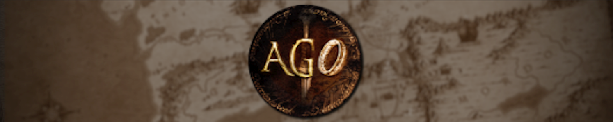

## Introduction
Welcome to Divide & Conquer AGO V3, a Lord of the Rings based mod for Medieval II: Total war. It uses the Engine Overhaul (M2TWEOP) to expand the capabilities of the game. This is a standalone mod which used Divide & Conquer V4 as a base, which itself is based on Third Age: Total War. The core philosophy of the mod is providing players with an immersive experience set in the Third Age of Middle-earth, during the War of the Ring. If you want to see the old features page, you can find it at [Features (V2)](../features_v2)

## Campaign Overview
The campaign starts in 3010 T.A., about 9 years before the main events that happen during the War of the Ring in the Lord of the Rings.

There are 26 playable factions, each with their own unique rosters, scripts and campaign experience. The factions are sorted into various allegiances: The forces of good which try to prevent Sauron from regaining the One Ring or even destroy it altogether, The allies of Sauron which try to regain the One Ring for their master, the allies of Saruman that try to capture the One Ring for the White Wizard, and neutral factions who are interested only in themselves. The alliances are rigid but there are narrative scripts for various factions which can make them switch sides in the conflict.

-------------------------------------------

- [Divide and Conquer: AGO](#divide-and-conquer-ago)
- [General](#general)
  - [Introduction](#introduction)
  - [Campaign Overview](#campaign-overview)
- [Features](#features)
  - [Launcher](#launcher)
  - [AI](#ai)
    - [Battle AI](#battle-ai)
    - [Campaign AI](#campaign-ai)
  - [Campaign Mechanics](#campaign-mechanics)
    - [The One Ring](#the-one-ring)
      - [Spy Networks](#spy-networks)
      - [Taking the One Ring](#taking-the-one-ring)
      - [Fate of the One Ring](#fate-of-the-one-ring)
    - [Dynamic Replenishment Pools](#dynamic-replenishment-pools)
    - [Seasons](#seasons)
    - [Character Ageing and Immortality](#character-ageing-and-immortality)
    - [Natural Disasters](#natural-disasters)
    - [Auto-Expansion](#auto-expansion)
    - [Last Stand Armies](#last-stand-armies)
    - [Historic Events](#historic-events)
    - [Unit Prefixes](#unit-prefixes)
    - [Settlement Rebuilding](#settlement-rebuilding)
    - [Rebel Factions](#rebel-factions)
    - [Dynamic Bodyguards](#dynamic-bodyguards)
    - [Revealed Allied Settlements](#revealed-allied-settlements)
    - [Garrison Script](#garrison-script)
    - [Faction Revival](#faction-revival)
    - [Campaign Ground Types](#campaign-ground-types)
    - [Palantiri](#palantiri)
    - [Guild Overhaul](#guild-overhaul)
      - [New Guilds](#new-guilds)
    - [Trade Resources](#trade-resources)
    - [Generic Map Models](#generic-map-models)
    - [Character Strategy Models](#character-strategy-models)
    - [Settlement Strategy Models](#settlement-strategy-models)
    - [Fixed Fortifaction Levels](#fixed-fortifaction-levels)
    - [Auto-resolve Modifiers](#auto-resolve-modifiers)
    - [Unit Value Modifiers](#unit-value-modifiers)
    - [Hide Army Info](#hide-army-info)
    - [Automatic Unit/Trait/Ancillary Descriptions](#automatic-unittraitancillary-descriptions)
    - [New Traits and Ancillaries](#new-traits-and-ancillaries)
      - [New Traits/Ancillaries](#new-traitsancillaries)
      - [Changes to existing Traits/Ancillaries](#changes-to-existing-traitsancillaries)
    - [Stack Sorting](#stack-sorting)
    - [Improved Faction Unions](#improved-faction-unions)
    - [New Cultures](#new-cultures)
    - [Custom Bodyguards](#custom-bodyguards)
    - [New Settlements](#new-settlements)
    - [Minor Settlements](#minor-settlements)
    - [Raiding](#raiding)
    - [Post Battle Loot](#post-battle-loot)
    - [Map Changes](#map-changes)
    - [Landmark Buildings](#landmark-buildings)
    - [New Gamemodes](#new-gamemodes)
    - [Misc. Changes](#misc-changes)
  - [Battle Mechanics](#battle-mechanics)
    - [Morale Adjustments](#morale-adjustments)
    - [Hero Abilities](#hero-abilities)
    - [Ground Type Modifiers](#ground-type-modifiers)
    - [Unit Highlighting](#unit-highlighting)
  - [Formations](#formations)
    - [Default skirmish mode](#default-skirmish-mode)
    - [Freecam Integration](#freecam-integration)
  - [Battlemaps](#battlemaps)
    - [Settlements](#settlements)
    - [Custom Tiles](#custom-tiles)
    - [Textures and Vegetation](#textures-and-vegetation)
    - [New Weathers](#new-weathers)
    - [Custom Battlemap Locations](#custom-battlemap-locations)
  - [UI](#ui)
    - [Main Menu UI](#main-menu-ui)
    - [Faction Specific UI](#faction-specific-ui)
    - [Map Screen](#map-screen)
    - [Custom UI Elements](#custom-ui-elements)
    - [Welcome Screen \& Difficulty Settings](#welcome-screen--difficulty-settings)
    - [Custom Colours](#custom-colours)
    - [Unique Buildings \& Chains](#unique-buildings--chains)
    - [Unit Cards](#unit-cards)
    - [Portraits](#portraits)
    - [Loading Screens](#loading-screens)
    - [Misc. Changes](#misc-changes-1)
  - [Sounds](#sounds)
    - [Ambient Sound Overhaul](#ambient-sound-overhaul)
    - [Battle Horns](#battle-horns)
    - [Character Selection Sounds](#character-selection-sounds)
      - [Heroes](#heroes)
      - [Races](#races)
    - [Music Additions](#music-additions)
    - [Historic Event Sounds](#historic-event-sounds)
    - [Restored Surround Sound](#restored-surround-sound)
    - [Custom Voice Acting](#custom-voice-acting)
  - [Performance Improvements](#Performance-Improvements)
  - [Bugfixes](#bugfixes)
  - [Engine Overhaul Project](#engine-overhaul-project)
  - [Submodding Tools](#submodding-tools)
- [Faction Changes](#faction-changes)
    - [Dunland](#dunland)
      - [New Features](#new-features)
      - [New Visuals](#new-visuals)
      - [New Scripts](#new-scripts)
    - [Dorwinion](#dorwinion)
      - [New Visuals](#new-visuals-1)
      - [New Features](#new-features-1)
      - [New Scripts](#new-scripts-1)
    - [AA](#aa)
      - [New Scripts](#new-scripts-2)
    - [Angmar](#angmar)
      - [New Scripts](#new-scripts-3)
    - [Bree](#bree)
      - [New Scripts](#new-scripts-4)
      - [New Features](#new-features-2)
      - [New Visuals](#new-visuals-2)
    - [Dale](#dale)
      - [New Scripts](#new-scripts-5)
      - [New Features](#new-features-3)
    - [Dol Guldur](#dol-guldur)
      - [New Visuals](#new-visuals-3)
    - [Ered Luin](#ered-luin)
      - [New Visuals](#new-visuals-4)
      - [New Features](#new-features-4)
    - [Goblins of Moria](#goblins-of-moria)
      - [New Visuals](#new-visuals-5)
      - [New Features](#new-features-5)
      - [New Scripts](#new-scripts-6)
    - [Gondor](#gondor)
      - [New Visuals](#new-visuals-6)
      - [New Features](#new-features-6)
      - [New Scripts](#new-scripts-7)
    - [Dol Amroth](#dol-amroth)
      - [New Features](#new-features-7)
    - [Harad](#harad)
      - [New Descriptions](#new-descriptions)
      - [New Landmarks](#new-landmarks)
      - [New Ancillaries](#new-ancillaries)
    - [High Elves](#high-elves)
      - [New Visuals](#new-visuals-7)
      - [New Features](#new-features-8)
      - [New Scripts](#new-scripts-8)
    - [Khazad-Dum/Balin's Expedition](#khazad-dumbalins-expedition)
      - [New Scripts](#new-scripts-9)
      - [New Features](#new-features-9)
    - [Khand](#khand)
      - [New Visuals](#new-visuals-8)
    - [Lothlorien](#lothlorien)
      - [New Features](#new-features-10)
    - [Northern Dunedain](#northern-dunedain)
      - [New Features](#new-features-11)
      - [New Visuals](#new-visuals-9)
    - [Rhun](#rhun)
      - [New Features](#new-features-12)
    - [Rohan](#rohan)
      - [New Visuals](#new-visuals-10)
    - [Woodland](#woodland)
      - [New Features](#new-features-13)
    - [Isengard](#isengard)
      - [New Scripts](#new-scripts-10)
      - [New Visuals](#new-visuals-11)
    - [Gundabad](#gundabad)
    - [Enedwaith](#enedwaith)
    - [Erebor](#erebor)

# Features
The following is a comprehensive list of features that are present in this submod, many of which are exclusive to AGO and offers features never before seen in any Medieval 2 modification.

## Launcher
To help users configure their game and install updates to the mod more easily, we have developed a custom launcher. Using the launcher you can

- Launch the mod
- Configure some game, EOP and mod settings all in one place
- Download and install updates to the mod automtically
- Get notified when new updates to the mod are available
- Read brief news updates about the status of the mod

If you want to contribute to or modify the launcher for use within your own mod, you can find the source code [here](https://github.com/Divide-and-Conquer-AGO/ago-launcher).



## AI
### Battle AI
Battle AI has been completely re-written from scratch in Lua and at the engine level, using the Engine Overhaul Project. The most important changes are that

- The AI should now be less prone to getting "stuck" and should generally be a lot more active
- The AI will now have custom behaviour when defending certain settlement levels such as villages
- The AI should now be able to better determine if it should attack or use it's range superiority
- The AI will now attack multiple gates during siege battles making defending siege battles a lot more interesting
- The AI can now properly use hero abilities in battles
- The AI can now properly attack gates with elephant artillery units (vanilla bug)

### Campaign AI
Campaign AI has been completely re-written from scratch in Lua and at the engine level, using the Engine Overhaul Project. Many hardcoded limitations have been removed and AI controlled factions should now play more like a player. 

- Allies will now actively help other allies in sieges and field battles if they are within range
- The AI is now weighted to prioritize stronger and less defended settlements, where it makes sense
- Every faction is now weighted to target and assists other factions of a given culture. 
  - For example, Gondor will priortize helping the Dunedain and Rohan and priortize destroying Orcs and Evil Men, with a unique hatred for the Ar-Adunaim
- Every faction is now weighted to priortize specific settlements
  - For example, Dunland will priortize capturing Edoras and Helm's Deep while focusing on protecting Isengard and Byrig
- Rebel AI has been significantly expanded such that they will now actively move around the map, join forces and attack armies and settlements
  - With the expanded rebel faction feature, this effectively enables the "Independant Realms" to be a conglomerate of small, non-playable factions that can function very similar to playable factions 
- The AI will now properly merge its smaller forces into proper armies
- The AI will now properly assign generals to it's larger armies


TBD - Add more screenshots



## Campaign Mechanics

### The One Ring
In comparison to Third Age and DaC, AGO has it's own custom ring script. This has been completely re-written in Lua for V3 and heavily expanded upon. The general flow of the the One Ring script works as such

#### Spy Networks
- The One Ring will randomly spawn on a character around the map, with a bias towards characters that are near Goblin Town, where it was lost by Gollum many years ago
- In order to discover the location of the One Ring, the player will have to establish Spy Networks inside other factions
- To establish a new Spy Network, move a Spy into a faction's capital or key settlement and wait.
- You will get a notification once the Spy Network has been established.
  - Spy Networks can be upgraded and downgraded for a cost
  - Spy Networks cost gold to upkeep

As the spy network upgrades, you will get the following benefits
  - Level 1: You will be notified if the One Ring is found in this region
  - Level 2: Income, Population and current settlement information
  - Level 3: Army Strength information with Medium confidence and ability to steal that faction's current map information
  - Level 4: Army Strength information with High confidence
  - Level 5: Suggestions welcome!

#### Taking the One Ring
- In contrast to Third Age and DaC, the One Ring is an actual ancillary held by a character, not held inside a settlement. This means that in order to acquire the One Ring for yourself, you must find the character who holds it, defeat them in battle and claim it for yourself.
- If however, the One Ring is held by a character inside a settlement, there is a small chance the Elves of Dunedain factions will call for a Tûl Acharn (vanilla jihad), calling all the Free People's of Middle-earth to converge on the settlement and reclaim the One Ring. Respectively, the forces of Evil can also call an invasion (vanilla crusade) on the settlement where the One Ring is located
- The AI does not know where the One Ring is unless their characters actually see it on the strategy map. This means that if you or the AI wish to hide the location of the One Ring, it is actually possible 
- The One Ring is now a much more powerful ancillary granting a wealth of bonuses to the character that holds it

#### Fate of the One Ring
- Once the One Ring has been captured by a faction, there a number of things they can do with it
- Regardless if the player or the AI holds the One Ring, they are a number of options available to them, with different options being weighted depending on the factions allegiance. For example, some factions will never keep the ring, some will always attempt to destroy it and some have different chances to keep it for themselves. In any case, the following scenarios can be played out once a faction has acquired the One Ring
  
  - Good factions can attempt to destroy the One Ring by calling for a Tûl Acharn on the Black Gate and casting it into Mt. Doom
  - Evil factions can attempt to bring the One Ring to Sauron or Saruman
  - Good/Evil factions can be consumed by the effects of the One Ring and keep it for themselves
  - The One Ring can be lost and the cycle repeats



### Dynamic Replenishment Pools
In order to automatically balance unit replenishment pools across the world and make them more immersive, replenishment rates are now automatically adjusted based on the settlements current population, public order, faction's primary culture and ownership of the One Ring.

### Seasons
The campaign uses a 6-turn per year system with dynamic seasons. There are seasonal traits with bonuses or maluses which can apply to your characters depending on the climate they are in and their preferred climates. For example, Angmar characters will perform better when fighting in the cold North and will perform worse the further south they travel.

### Character Ageing and Immortality
Since V3, mortal races can die of natural causes during the campaign. How old they get before they can die depends on various factors such as their race and traits that affect their health. For example, characters that are Nazgul or characters that hold the One Ring cannot die of natural causes. Because the maximum age the game can store is 127, immortal characters will stay 125 years old indefinitely once they reach that age.

### Natural Disasters
Earthquakes, storms, floods, forest fires, dust storms, snowstorms, tidal waves, locust invasions and famines can trigger randomly during your campaign, with various effects depending on the disaster. Some of these have visual effects as well, and the forest fires are scripted to permanently deforest areas. These occur very rarely and can be disabled. They effect the player and the AI.



### Auto-Expansion
AI factions will get some free territories at the start of the campaign to help balance the campaign. In V3, this happens before you fully load into the campaign and will not slow-down the first turn. The expansion armies are also randomly generated, with unique custom generals with random bodyguard units. There is an extensive generator scripted that makes sure that a general gets the right traits, portrait, name and ancillaries depending on the bodyguard unit. This helps create a more unique experience for every campaign.

### Last Stand Armies
AI factions get a helping stack of elite units once they go down a certain threshold of held regions depending on their starting domain size. In V3, these are dynamically scripted to contain regional units depending on which regions the faction still holds.

### Historic Events
You have access to a new screen where various campaign events are written down over the course of your specific campaign. These events are written from the perspective of a historian chronicling what has happened in your version of Middle-earth, in this campaign. You can also easily copy the events to your clipboard and share with your friends or as a backup for reviewing later!



### Unit Prefixes
The game's "Legio" prefixes have been replaced with more appropriate text depending on the faction. The Roman numeral afterwards also displays the turn in which the unit was recruited, instead of keeping count of how many of them were constructed.



### Settlement Rebuilding
Some settlements such as Fornost, Osgiliath and Annúminas can be restored to their former glory by certain factions. New in V3 is that you can also cleanse Minas Morgul, Isengard and Dol Goldur and rebuild Tharbad and Adun-Eth. The method by which you cleanse or rebuild these settlements varies. Some require a certain level of culture while others require special buildings. Some settlements are also scripted to dynamically change their name based on their owners.



### Rebel Factions
Rebel factions have been completely overhauled and with the help of the Engine Overhaul have been given unique banner colors and symbols. They also have appropriate but randomized character strategy models. As rebel AI has been significantly expanded such that they will now actively move around the map, join forces and attack armies and settlements it effectively enables the "Independent Realms" to be a conglomerate of small, non-playable factions that can function very similar to playable factions. 

In total, there are 38 new rebel subfactions. Not all are on the map at game start as some emerge as part of events such as during Dorwinion's new scripts. Some of the more interesting new rebel factions include

- Lossoth Tribesmen
- Avari Elves
- Wraiths of the Barrow Downs
- Corsair Raiders
- Rhudaur Hillmen
- Men of Harondor



### Dynamic Bodyguards
Some factions have multiple standard bodyguards, which are dynamically allocated based on the sub-race of the character. Here are some examples

- Arulad 
  - Arulad Dragonguard
- Longbeard
  - Longbeard Phalanx
- Kugathi
  - Kugathi Rátha
- Isendraich 
  - Isendraich Towersworn

### Revealed Allied Settlements
Allied settlements are now visible on the strategy map, helping you keep up with how your allies are doing. It is written from the perspective of a historian chronicling the events of your individual campaign.



### Garrison Script
The garrison script gives permanent defenders to key AI settlements in the campaign to help make the battles for these important locations more interesting and help with campaign balance. These garrisons have been overhauled in V3 to now include unique compositions of units depending on the settlement, making it challenging to capture them. A special kind of script is in place for Western Moria, where only if a player attacks it a very powerful defender awakens from the depths...



### Faction Revival
Most factions can be revived after they have been utterly defeated during the campaign by other factions with the same allegiance. If their original capital is held by rebels, they can revive on their own too.



### Campaign Ground Types
The movement modifiers for various ground types in V3 vary slightly depending on the faction. This means that, for example, Elves do not have much trouble moving through forests while Dwarves get slowed down a lot by them.

### Palantiri
In vanilla Third Age/DaC the Palantiri provide flat building bonuses for whoever owns them. In AGO V2, if one was owned, it automatically toggled the Fog of War briefly at the start of a player's turn. In AGO V3, they can be used to manually reveal an area of the map. Certain characters like Denethor, Saruman and Sauron reveal greater areas when they use a Palantir. After using a Palantir, it goes on a short cooldown at which point they can be used again.



### Guild Overhaul
For too long the very interesting guild system has been neglected and bugged but no longer! Now the entire system has been re-written in Lua with EOP to accommodate a wider variety of triggers for gaining guild points as well as a new GUI so you can easily assess your standing with each guild in each settlement and intuitively learn how to earn new points! It also allows us to place additional restraints on certain guilds such as making them region specific or locked until certain other events have occurred.

In addition, vanilla guilds have been re-reworked and 3 brand new "guilds" have been added, bringing a total of 12 guilds to the mod!

#### New Guilds
**Pipe-weed Farms:** Available in Bree and Gondor. This guild has two tiers with extra bonus points being gained for your governors having higher levels of the new Pipe-weed smoker trait

**Corsair Havens:** Available in coastal regions in Southern Middle-earth. This guild also has two tiers and is only available if your governor is especially corrupt or neglectful. It comes with a small public order malus in exchange for the rare recruitment of some Corsairs (now returning as an independent rebel faction)

**Thieves' Guild:** Available for most Men factions, this guild allows for the recruitment of additional spies (which are especially needed for setting up your spy networks) as well as some ruffians at the higher tier. It also comes with a small public order malus.

**Wayfarer's Guild:** Available for most Men factions, this guild allows for the automatic construction of watchtowers on your borders and easier acquisition of map information.



### Trade Resources
Trading resource placement across the map and their value has been overhauled to help boost trade. A few new resources have been added as well in V3: Kine of Araw, Copper and Camels.

Some resources get unique models depending on the geographical locations as well. Custom tiles are placed on some of their locations with ambient structures such as villages and farms.



### Generic Map Models
As the Engine Overhaul Project allows us to place strategy models anywhere on the map, regardless if they are a resource or not, we have placed a number of new models across the campaign map in a number of locations. Examples include the Pillar of Umbar, the Forsaken Inn in the Breeland, Lossoth villages in Forodwaith, ancient ritual sites in Dunland and Enedwaith and a frame for the map to mask the black abyss that previously occupied that space.

The Forsaken Inn and Pillar of Umbar are linked to scripts and change based on the progress of the script. For example, as you advance through the Forsaken Inn building line, it transitions from a ruined inn to a formiddable fort, both in the settlement browser and on the campaign map.



### Character Strategy Models
While AGO V2 massively expanded the number of character strategy models in comparison to DaC and TATW, it has again been massively expanded for V3. Over 40 new character strategy models have been added for captains, generals, agents as well as ships. Unique to AGO V3 is the ability for certain factions to have varied captain cas models rather than using the same single model for every captain character on the map. For example, Mordor has 5 different strategy model variations for it's captain, each varying in shape and size.



### Settlement Strategy Models
As the Engine Overhaul Project allows us to set the strategy model of any settlement on the map without any limitations, we have taken advantage of this by creating numerous new settlement models to make each area feel more distinct and each faction unique.



### Fixed Fortifaction Levels
Traditionally, it was required to build certain types of siege equipment in order to assault a settlement even if it was not actually necessary on the battlemap (i.e the settlement actually had no gate or no walls to use siege towers/ladders on). Now, the settlement can be assaulted straight away if it's not actually necessary to build siege equipment for that battle map.

### Auto-resolve Modifiers
Traditionally, certain types of units (like those with very high armour values) were heavily weighted in auto-resolve calculations. This often meant that the results of auto-resolved battles did not align with what would often occur on the battlemap. In order to remedy this issue, a variety of modifiers are now applied as part of the auto-resolve calculation. For example, cavalry units, units with "relentless" animations, units with body piercing arrows and pike units have no all been correctly weighted to more accurately reflect their performance in battle.

### Unit Value Modifiers
Often times AI armies were largely composed of either low tier or nonsensical units such as siege weapons which often both ruined the AI's ability to field capable armies. To remedy this issue, all units have now been given logical "AI Value" values so that the AI can now more accurately assess what units which actually perform well for them.

### Hide Army Info
In order to provide a more immersive experience, the option to block the vision of units in an army without "true vision" has been added. This will make utilizing spies and scouting more important. 



### Automatic Unit/Trait/Ancillary Descriptions
The additional unit effects and effects of trait and ancillaries are now automatically generated when the game starts up, meaning they will always be 100% accurate. This is done in a non-destructive way, meaning no file changes are made. It also makes adding new traits/ancillaries and changing unit stats much less of a burden for modders.



### New Traits and Ancillaries
A wide variety of new traits and ancillaries have been added as well as some changes to existing trait effects. Some highlights include

#### New Traits/Ancillaries
- New biographies for Ered Luin's starting generals
- "Pipeweed" smoker trait with 4 different levels
- "General Kill Count" trait with 7 different levels that keeps track of your generals personal number of kills and provides a number of combat related bonuses on levelling up
- New subculture traits for a variety of factions such as Dunland, Dorwinion, Dale, Corsairs, Harondor, Lossoth etc.



#### Changes to existing Traits/Ancillaries
- One Ring effects have been significantly improved
- Hitpoint gains from traits/ancillaries have been normalized to take into account the +5 hitpoint cap from traits/ancillaries. This should prevent normal generals from starting the game with max available hitpoints.

### Stack Sorting
Armies on the campaign map will now be "sorted", as it is in newer Total War games. This makes it much easier to, at a glance, determine what types of units are in an army. The player can sort their own armies manually with a rebindable hotkey and the AI's stacks are sorted automatically at the end of their turn. You can also configure the sorting algorithm for this functionality if you have a preference by which you sort your armies.



### Improved Faction Unions
Faction unions have been significantly improved. Forming Arnor and the Reunited Kingdom is now seamless, no longer requiring the execution of batch files outside of the game. Arnor and the Reunited Kingdom now also have received their own custom faction names, colours, banners and UI elements to make forming of these once great kingdoms much more impactful.

The Elven Union has also been improved. If you accept the union as either the Woodland Realm or Lothlorien, your faction name will now change to "Eryn Lasgalen" and the colour of your faction and it's borders will also change. The Woodland Realm or Lothlorien can now form the union when being controlled by the AI and they will also change.

### New Cultures
Gundabad and Dunland have received their own in-game culture to reflect their unique identity in Middle-earth. It is also now possible for the Whitehand culture to becomes Dunland's dominant culture, depending on the decisions they make in the campaign.

Culture buildings will now also automatically be converted to your culture's equivalent instead of being destroyed.

### Custom Bodyguards
Over 25 generals have received new bespoke bodyguard units with their own custom models, descriptions and stats. This includes new Temple bodyguard units for the Nazgul, Harad, Ered Luin, the High Elves and the Woodland Realm to name just a few.



TBD - Add screenshots

### New Settlements
Mengelen, the settlement in the Barrow Downs has been removed and replaced with another settlement, Gorathul, in the Misty Mountains. Having a settlement in the Barrow Downs did not really make much sense and having a settlement on the western side of the Misty Mountains, in the South, allows the Goblins and Khazad-Dum more expansion options and should make their campaigns play out less formulaically.

### Minor Settlements
Over 10 new "minor" settlements have been distributed across the map, often in locations where the map felt empty or where it made logical sense for their to be a settlement. Minor settlements function slightly differently to major settlements in that you cannot build farms, roads or ports there. In addition, many of these minor settlements are often part of one of the aforementioned "rebel factions". The AI is aware of these settlements and knows they are "minor" settlements.



### Raiding
In order to provide more gameplay options than just attacking settlements or characters, factions that are evil or neutral aligned can "Raid". Raiding comes in two forms

**Active Raiding**
Active raiding involves moving a character onto a resource belonging to a faction you are currently at war with. You will now have the option to perform a raid on this resource, capturing loot (gold) and slaves (population) from the targeted faction. These resources are then added to your character's inventory and must be brought back to a settlement to be "cashed in". The loot will be added to your total gold and the slaves to the population of the given settlement.

The amount of loot and slaves you acquire from a raid is dependant on many factors including the size of your army, the type of resource itself, the traits of the character leading the raid, how much money the faction being raided has and so on. After 12 turns have passed since the original raid, the resource will become raidable again.

The AI, including rebel factions, can and will perform active raids on your resources. When this happens, you will recieve a notification so that you have an oppurtunity to defeat them and reclaim the loot that was stolen from you.

**Passive Raiding**
Passive raiding works in the same way as active raiding except a specific resource is not raided but rather the general lands. Simply move a character onto a tile inside enemy territory and you will begin passively raiding them. Passive raiding income is influenced by the season, tile ground type, tile climate, regional harvest and army size. You do not get slaves from passively raiding.

Similar to active raiding, the AI will also passively raid you and you will also recieve a notification if the amount of loot they currently hold exceeds a large proportion of your current income or the income of the region they are raiding.



### Post Battle Loot
The "Spoils of War" script that existed previously has been incorporated into the raiding system. Rather than defeating an enemy army and instantly acquiring gold as a result, it's now added to your characters loot. As such, it will also need to be returned to a settlement to be "cashed in". However, if you defeat an enemy army in battle and they have loot, you will acquire their loot and add it to your own.

### Map Changes
In order to accomodate certain faction overhauls and to make certain parts of the map more accurate, some terrain and climate changes to the map were made. For example, the Barrow Downs area of the map has been reworked as previously it did not make much sense and now part of it, including the wights, are part of both the Bree and Metraith regions. In Dorwinion, the forests and mountains have been reworked to make the region feel less barren and to allow a space for the main Avari settlements to be located. In the Misty Mountains, a new pass was added south of Moria that leads to Gorathul, the new goblin settlement and across the whole map the height of the mountains has been raised so they feel more like actual mountains and less like hills.



### Landmark Buildings
While there are plenty of interesting settlements in Middle-earth, there are also many settlements that populate the map that have absolutely no lore, pre-built buildings or even any interesting resources. Previously, special buildings were often only relagated to named settlements. In order to make the lesser known settlements feel more unique, we have implemented over 30 new 'landmark" buildings. These landmark buildings vary from geographical features, sites of famous battles, places of worship, mercenary strongholds, trading houses and so on. 

Each landmark building has a rich description and unique art and many of them also provide special bonuses relevant to the region. They can be found all across Middle-earth, with the regions of Harad and Harondor getting the most attention.



### New Gamemodes

**Shattered Alliances**
Shattered Alliances, the traditional gamemode where all factions start neutral with each other has returned. Due to certain constraints, this version still has scripts enabled.

**Randomized Start**
If madness has overcome you, you may try the new randomized start gamemode where every single faction starts with completely randomized starting locations and armies.



TBD - Add screenshot

### Misc. Changes
- Added shortcut to cycle through idle characters (excluding those in a settlement/fort) on the strategy map
- Added the ability to disable land stand armies from spawning

## Battle Mechanics

### Morale Adjustments
Base morale levels have been reduced across the board in order to make battles feel more dynamic and less reliant on sniping the enemy general. Units are now much more likely to rout and return to the battle and command effects, hero abilities and unit abilities are now much more important to bolstering/crushing morale.

### Hero Abilities
All hero abilities have been completely re-written from scratch to make them more interesting to use and to be less like buttons you just spam on cooldown.

### Ground Type Modifiers
A lesser known feature of Medieval 2 are battle map ground type modifiers. Certain ground types such as mud, roads, grass, ice, snow, sand etc. all effect how fast a unit can pass through them as well as how effectively units can fight in them. 

These effects have been reworked from scratch and the ability to check the ground type at any moment has been added. This should allow for more tactical decision making in battles such as positioning your line infront of a patch of mud to slow down the enemy charge or preparing your flank along a road.

### Unit Highlighting
The ability to toggle the highlighting of units has been bound to a hotkey, allowing you to toggle unit highlighting without having to press a button and without having to use the default "large" UI. The unit highlight colours have also been reworked to be more in line with the theme of the game.

### Formations
The horde formation was given to many low tier, militia units that probably wouldn't have the proper training to maintain a solid formation. Similarly, the wedge formation was given to a number of heavy cavalry units and the ability to hide anywhere/hide in forests was removed from many units where it didn't make sense. These changes should make add a bit more variety and make units feel more distinct from each other.

### Default skirmish mode
The ability to disable skirmish mode automatically for all player units at the start of a battle has been added

### Freecam Integration
The excellent and very popular [Freecam](https://www.moddb.com/mods/freecam-medieval-2) modification has been integrated automatically with the Engine Overhaul Project. The application comes bundled with the mod and if Freecam Integration is enabled, it will automatically start and close along with the game.

## Battlemaps

### Settlements
Harad, Khand and Rhun have received new custom settlement battlemaps, replacing their previously vanilla counterparts. Harad and Khand share a set and Rhun has their own custom set. We extend our wholehearted thanks to [Ariovistus](https://www.youtube.com/watch?app=desktop&v=54NjsHf8Dcg&t) for these settlements.

Wildmen towns have also received new battlemaps, thank you very much to De Bello Mundi for their contribution here.

Faen'obel and Tharbad have also received brand new custom battlemaps made by the very talented "WK | Kautto Ville". We extend our wholehearted thanks to him also, for his assistance in implementation of these maps and other queries during development. Helcarin (previously Caras Sant) now also has a custom battlemap courtesty of Eclipse.



### Custom Tiles
A custom tile is a location on the campaign map that has a custom battlemap that is not automatically generated based on the terrain. Locations such as the Tower Hills, the Argonath and the tunnels in Moria have custom tiles. With the Engine Overhaul Project the limit on custom tiles has been removed. They can also be set dynamically rather than having to maintain a hardcoded list.

As a result, the number of custom tiles in the mod has been vastly expanded. Village resource tiles now have different battlemaps based on where they are located in the world, all barrow resources use the Barrow's custom battlemap and many custom battlemaps have been re-used in appropriate locations across the map.

### Textures and Vegetation
In comparison to Third Age and DaC, AGO has custom made battlemap textures and custom vegetation (Thank you to EB2) for all climate and terrain combinations. These textures are higher resolution and fit more appropriately than the vanilla textures and for winter maps, produce a lot less glare than usual.

### New Weathers
AGO now uses the latest version of Swagger's weather and skyboxes mod, including new skydome meshes that reduce stretching of the skybox textures as well as new lighting in some instances. Certain locations such as Forodwaith and Mordor have also recieved completely new custom weathers to make them feel more unique and immersive.



TBD - Add more screenshots

### Custom Battlemap Locations
The list of available battlemaps in custom battle has been expanded to include many more locations, especially for more unique locations such as Forodwaith, An-Karagmir, The Angle and so on.

## UI

### Main Menu UI
The main menu UI has been overhauled. It now includes a dynamic background, new main menu music and a re-designed faction selection screen.



### Faction Specific UI
Rather than interface textures being shared across multiple factions, they can now be unique per faction. Many factions have received new custom user interfaces and many old interfaces were overhauled.



### Map Screen
The map screen provides a more comprehensive and higher resolution view of the campaign map as well as a variety of filters and layers that display different geographical, financial and demographical information about Middle-earth.

It also allows you to view, manage and upgrade your spy networks, which are essential in your search for the One Ring.



TBD - Add more screenshots

### Custom UI Elements
In order to facilitate the usage of new scripts and mechanics, we have developed many custom UI elements. These UI elements allow the player to track the progress of scripts, perform raiding, use the Palantiri, assess their standing with guilds, display events, display events with multiple choices, display menus for custom scripts and manage individual characters. These UI elements also contain custom theming for every faction and stick as close as possible to the vanilla game's interface style in order to make them feel seamless.



### Welcome Screen & Difficulty Settings

Once you start your campaign you are greeted with a welcome screen where you can toggle various settings such as active scripts and difficulty settings. Difficulty settings you change here change what the game applies when you select a campaign difficulty, allowing you to customize the difficulty to your liking. 



### Custom Colours
In order to provide a more friendly and immersive experience, all instances of overly bright and fluorescent colours have been toned down. Every faction now also has custom selection colour and any instance of the unreadable beige coloured text (even the previously hardcoded ones) has been recoloured to be black.



### Unique Buildings & Chains
Many building chains now have new, custom made UI and the UI for all unique buildings has been re-done, with custom frames for each culture



### Unit Cards
Every single unit in the game has received new unit and unit info cards. These new unit info cards allow players to tell, at a glance
    - What type of weapon(s) the unit uses
    - What faction the the unit comes from
    - Whether the unit is a custom bodyguard unit or not
    - The various armour upgrade models the unit might recieve

This new style of unit info card also allows the user to make out the more interesting details on many of the models which can sometimes be missed in the heat of the battle.



### Portraits
The generic and custom portraits for Khand, Harad and Rhun have recieved overhauls so that they no longer heavily rely on vanilla middle eastern portraits. All their starting generals should now have custom portaits. Many other generals have had their custom portraits updated, with each recieving the appropriate cultural background. Isengard has also receieved a new custom set of portraits so that they no longer share portraits with other orc factions and the Wildmen have also had their portraits overhauled so they fit more with those faction's identities.



### Loading Screens
Loading screens have been expanded, upscaled and compressed to reduce them in size while also improving their quality. The mod now contains over 450+ loading screens, containing handmade art by artists in the LOTR community as well as some original pieces created by the mod team itself.



### Misc. Changes
Various other miscelleanous UI changes have been made to make the overall experience more immersive and useable



## Animations

### Bowstring Animations
In vanilla DaC and Third Age, archers and crossbowmen don't knock real arrows and the bowstring doesn't move at all when they aim their bows. In AGO, every archer and crossbow unit (with some exceptions) uses proper bowstring animations and knocks a real arrow when they take aim.



### New Death Animations
Courtesty of the [Death Throes](https://www.moddb.com/mods/death-throes/videos/death-throes-custom-deaths-for-medieval-2-total-w) animation pack, AGO now has many new custom death animations.

<div style="text-align: center" class="download-embed">
    <iframe allow="fullscreen;" frameborder="0" width="500" height="500"
    src="https://www.youtube.com/embed/ezVXCNvzOos?si=0Y5m_fNI4H9AGnNj">
    </iframe>
</div>

### Faster Diplomat Animations
In vanilla Medieval 2, diplomats had long and drawn out animations that slowed down campaign turns. These have been sped up to improve turn times.

## Sounds

### Ambient Sound Overhaul
Previously, Third Age and by extension DaC - used all vanilla ambient sounds. Medieval 2 actually came packaged with a very robust ambient sound system for the strategy map and this has been completely overhauled from scratch with more immersive sounds. Some of the new features available include

- 150+ new unique sounds - 45 minutes of audio in total
- Ambient sounds for Orcish, Dwarven, Elven, Men, Wildmen and Southmen settlements, different ones for Town and City
- Added brand new (climate appropriate) ambient sounds for generic Mountains, Hills, Dense and Sparse forests, Swamps, Beaches, Oceans, Khandish steppe and rocky deserts, different ones for Winter and Summer
- Added brand new location specific sounds for regions such as - Moria and the Goblin Tunnels - Mirkwood - Mordor - Dead Marshes - Brown Lands/Dol Goldur
- Normalized and (far too heavily) tested everything to make sure that everything sounds correct and blends correctly

<div style="text-align: center" class="download-embed">
    <iframe allow="fullscreen;" frameborder="0" width="500" height="500"
    src="https://www.youtube.com/embed/rkIrBnodrFY?si=MSboqY2Yr2ACvgkC">
    </iframe>
</div>

### Battle Horns
The number of Battle Horn sound effects that play when a unit is charging have been expanded

- Added 14 new Orcish War Horns
- Added 2 new Gondorian War Horns
- Replaced old and low quality War Horns for a number of factions

### Character Selection Sounds
Unique heroes and characters on the battle and strategy map now have special voicelines unique to that character when selected. The following characters have all received new voice lines

#### Heroes
- Sauron (10+ lines)
- Aragorn (30+ lines)
- Saruman (15+ lines)
- Lurtz (15+ lines)
- Gothmog (15+ lines)
- Gandalf (15+ lines)
- Boromir (10+ lines)
- Faramir (15+ lines)
- Gimli (15+ lines)
- Dain (15+ lines)
- Elrond (15+ lines)
- Thranduil (10+ lines)
- Legolas (15+ lines)
- Glorfindel (10+ lines)

#### Races
- Nazgul (15+ lines)
- Orcs (15+ lines)
- Uruk-hai (35+ lines)
- Rangers (15+ lines)
- Hobbits (15+ lines)

### Music Additions
To expand upon El Monstero's music mod, most factions have received new music tracks, 42 in total. These tracks are faithfully sourced from independant albums as well as commercial soundtracks centered on the world of the "Lord of the Rings"

### Historic Event Sounds
With the help of the Engine Overhaul Project, most factions should now have a set of custom sounds that play when a historic event fires for them rather than all using the same generic sound from vanilla

### Restored Surround Sound
Previously, if you wanted to use the surround sound features of the game, it was necessary to have a specific type of soundcard installed in your computer. Now, with the help of DSAOL, you can re-enable surround sound which helps battles feel a lot more immersive.

<div style="text-align: center" class="download-embed">
    <iframe allow="fullscreen;" frameborder="0" width="500" height="500"
    src="https://www.youtube.com/embed/7VFqKWQ29Eo?si=mLYuZ0yHTzPr1ILf">
    </iframe>
</div>

### Custom Voice Acting
In order to make Dorwinion feel more distinct from other Northmen factions they have received custom voice acting on both the strategy and battle map, courtesy of the very talented [Miloš Puhák](https://ko-fi.com/milospuhak). He has provided custom voice lines for each sub-race in Dorwinion, the Kugathi, Rouadengi and Leofthiuda so that each one feels distinct. In addiiton, they have received their own custom accent restored from the Teutonic Campaign in vanilla to fill in the gaps.

<div style="text-align: center" class="download-embed">
    <iframe allow="fullscreen;" frameborder="0" width="500" height="500"
    src="https://www.youtube.com/embed/krZna_0z4_Y?si=NzM93BitOI17EIfL">
    </iframe>
</div>

### Performance Improvements
- By porting many scripts from campaign_script to Lua, turn times have significantly been reduced to around 8-12 seconds on average. 
- New sprites have been regenerated for every single model in the game which should help improve performance and clarify for players not using the "Highest" setting of Unit Detail. 
- Strategy model textures have been optimized which saves the average user around 700mb of RAM 
- The BMDB has been cleaned of all unused units which significantly improves startup time 
- [Vulkan/DXVK](https://github.com/doitsujin/dxvk) rendering mode is not automatically available via EOP which can massively increase GPU performance for some users
- Internal game logic has been re-written by Fynn via EOP to make the game generally more performant

## Bugfixes
- The effects of "Trade fleets available" now correctly apply for users using the Steam version of the game
- The AI can now properly detect reinforcing armies when sallying out from settlements. This effectively nullifies the "sally out cheese".
- Autoresolve calculations for sea battles now more accurately align with what is displayed in the outcome bar

## Engine Overhaul Project
The mod extensively uses the features of the [Medieval 2 Engine Overhaul Project](https://github.com/youneuoy/M2TWEOP-library?tab=readme-ov-file#what-is-m2tweop). The main developers of the mod are also the main developers of this project and as such, have deep knowledge of it's capabilities and have made vast improvements to the Engine Overhaul Project in order to facilitate many of the aforementioned features. The Engine Overhaul Project currently offers the following features

* [Lua scripting system with 1000+ functions](https://youneuoy.github.io/M2TWEOP-library/_static/LuaLib/index.html) 
  * Full documentation with code examples and VSCode Intellisense
  * Seamless integration with existing campaign_script scripts
  * Hot-reload
  * Custom console
  * Debugging support (VSCode)
  * [ImgGui bindings](https://github.com/ocornut/imgui)
* Removes engine limitations for
  * Number of unit types and unit sizes
  * Number of religions and cultures
  * Number of buildings and their chains
  * Number of ancillaries
  * Number of custom settlements
  * Number of custom cas models (characters and settlements)
* Unlocks all vanilla console commands
* Fixes many engine bugs, crashes and oversights such as
  * Berserker units instantly crashing
  * Elephant units breaking sieges
  * Elephant cannons unable to attack gates
* Draw cas models at any scale, anywhere on the campaign map
* Fully customizable and configurable launcher
* Discord Rich Presence support for 30+ mods
* Rome: Total War style [Tactical Map Viewer](https://www.youtube.com/watch?v=RrGi4zxr7bU)
* Play out Hotseat battles online and transfer the results back to the campaign map
* Custom keybinding support
* Play custom sounds or music with support for WAV, OGG/Vorbis and FLAC

## Submodding Tools
While Medieval 2 is a very moddable game, there are certain aspects of modding that can be extremely tedious and tiresome. In order to alleviate these pain points and to help speed up development, the [Medieval 2 Modding Tool](https://github.com/FynnTW/ModdingTool) was developed. This tool comes with both a GUI and the ability to run from the command line as well as extensive Lua scripting capabilities.

What does this mean for you as a submodder? It means that

- All silver surfers have been removed as every faction now has ownership of every unit in the BMDB
- Trait and Ancillary effects are now automatically generated and 100% accurate
- Additional unit effects are automatically generated and 100% accurate
- Unit and unit info cards have been consolidated into a single folder "merc" and "mercs"
- Animation/Skeleton files are now all self contained within the mod folder and an updated descr_skeleton.txt file is now present
  - See the provided README file in `data/animations` for further information
- You can import/export the EDB, EDU and BMDB to JSON format for simpler editing or working with other projects
  - For example, the unit data on the website is generated automatically using the contents of these JSON files
- You can make batch edits to EDU, EDB or BMDB data or easily generate reports based on their content
  - For example, you can easily create a CSV file with a list of all units recruit times to identify anomalies 
- You can add new units by simply filling out a basic "form" in a Lua file and running a batch file e.g

```lua
createEntry(
    "eored_swords_upg",
    -- Mesh
    UNITS_FOLDER .. "Rohan_Lerynian/Eored_rohanswords_upg_lod0.mesh",
    -- Main Texture (Diffuse)
    UNITS_FOLDER .. "Rohan_Lerynian/textures/eored_upg_main_diff.texture",
    -- Main Texture (Normal)
    UNITS_FOLDER .. "Rohan_Lerynian/textures/eored_upg_main_norm.texture",
    -- Attachment Texture (Diffuse)
    UNITS_FOLDER .. "Rohan_Lerynian/textures/eored_upg_atch_diff.texture",
    -- Attachment Texture (Normal)
    UNITS_FOLDER .. "Rohan_Lerynian/textures/eored_upg_atch_norm.texture",
    -- Animation/Skeleton
    unitTypes.infantry.sword
)
```

# Faction Changes
In this section we will try and cover the major changes that are faction specific and new in AGO V3. To see a full faction's roster and all it's scripts, including those that were already present in DaC/TATW/AGO V2, please see their respective faction wiki entry. If a faction does not have a `New Scripts/Visuals/Features/UI` section, it can be presumed they didn't get any changes in this area.

-------------------------------------------

### Dunland
#### New Visuals
- A complete overhaul of the Dunland roster
- 10+ new custom strategy models, dependant the new ethnic groups
- A new custom celtic inspired Wildmen UI

#### New Features
- Overhauled music tracks
- 6 tiered "Raiding" trait that upgrades as your characters use the new raiding system
- Each turn there is a random chance your generals will perform sacrficial rites with a chance to gain a good or bad trait depending on the omens.

#### New Scripts
- **Subcultures**
  - From the Isendraich whose loyalty lies to the White Hand, the Dunforgoil who share close ties with the Rohirrim or the Wulfingir of Dunlending nobility, command a variety of generals from different cultures within Dunland
- **The White Wizard**
  - Saruman desperately needs you and your people to execute his plan. There are many in Dunland who wish to keep the old ways and many who want to see a new future for their people. Work with Saruman and your people to grow your nation in a dynamic script with multiple decisions, outcomes and rewards.
- **Raiders of Dunland**
  - Utilizing the new Raiding mechanic, level up your Dunlending generals by carring out raids on your enemies
- **Reforms**
  - Decide the future of the people of Dunland 
- **Kin/Raiding Lands**
  - Incorporate the lands of the Free People's into your own or designate them as nothing more than a source of gold and loot for your armies 

-------------------------------------------
### Dorwinion
#### New Visuals
- A complete overhaul of the entire Dorwinion roster
  - The roster is now made up for four distinct groups, the Rouadengi, Leofthiuda, Kugathi and Avari
- 10+ new custom strategy models, also dependant on whether the character is of Rouadengi, Leofthiuda or Kugathi descent
- Custom UI and banners

#### New Features
- Campaign map area of Dorwinion has been completely reworked to facilitate the new scripts
- Caras Sant/Helcarin now has a new custom battle map
- Dorwinion no longer starts with the Isle of Neburkah
- Dorwinion now has a custom name pool
- 6 new custom buildings
- 20+ new custom ancillaries and traits
- Custom voice acting for all units on both the strategy and battle map and the previously unused "Eastern European" accent to fill in the gaps. Different voice lines are used on the stratmap depending on if the character is of Rouadengi, Leofthiuda or Kugathi descent

#### New Scripts
- **Encircle the Sea of Rhun**
  - Establish trade outposts or "kantors" in capital cities of foreign nations you have trade rights with to enable them to recruit some of your units and the ability to recruit some of their units
- **Regentsmen Reforms**
  - Construct special education buildings in order to reform your military. Unlocks additional units, along with the choice to specialize in a specific field.
- **Sauron's Proposition**
  - Bow to Sauron's demands for accord with Rhun or stand defiant in the face of an overwhelming invasion. Recieve support from western allies while taking into consideration the wishes of the Avari.
- **The Rhûnnic Question**
  - Decide the fate of the Dragonswrath cult. Allow them to continue their practices and risk unrest at home or put an end to them for good and risk a renewed civil war in the lands of Rhun.
- **The Avari**
  - Carefully manage your relationship with the isolationist Avari. Allow them sanctity in their dark forests, declare them outlaws and a threat to the realm or simply find a balance. Dynamically manage your relationship with these foreign people, heavily influenced by your decisions in other scripts as well as smaller decisions you make throughout the campaign.

-------------------------------------------
### AA
#### New Scripts
- **Rebuild the Pillar of Umbar**
  - Rebuild the Pillar of Umbar in defiance of Sauron, signalling to your kinsmen you have established a foothold in Umbar. Provides a custom general and reinforcements from the South
- **Randomized AI colony start**
  - In addition to their preset auto-expansion settlements, the AA also recieve a random coastal settlement (Toggleable, AI only)

-------------------------------------------
### Angmar
#### New Scripts
- **Sauron's Will**
  - Capture historical Numenorean settlements such as Fornost and Annuminas to recieve custom Black Numenorean generals and reinforcements from Mordor
-------------------------------------------
### Bree
#### New Visuals
- Andy and the starting spy have recieved new custom portraits
- Bree now have a custom strategy and battle UI (Courtesy of Pythax)
- Added new unit "Trappersmen" by Fynn. Replaces Woodland Hunters.

#### New Features
- The Breeland's mercenary/isolation choice now starts at turn 44 instead of turn 69
- The settlement of Mengelen and the Cleansing of the Barrow Downs script has been removed
- Bree now starts with the settlement of Bucklebury with Esmeralda Brandybuck as it's governor
- Bilbo and Barliman no longer have traits that give them high Command but traits that are more lore accurate and that make them better governors
- Bree no longer has to be allied to ND to rebuild the Bridge of Tharbad
- Bree can no longer recruit Tharbad Royal Guard unless they are allied to ND
- There is a unique strategy model for Metraith, Tharbad and Adun-Eth if they are upgraded/rebuilt by Bree
- Bree can now recruit Thieves of Tharbad from the Mercenary Lodge if they go down the Mercenary Path
- Many Bree characters now start with the Pipeweed smoking traits and they get a special boost with the Pipeweed Guild
- AI Bree get a randomly generated commander from the options presented to the player as their faction leader

#### New Scripts
- **Forsaken Inn**
  - Restore order to the Bree-land by repairing and upgrading the Forsaken Inn
- **Create Your Commander**
  - The Bree-land needs an experience commander to lead it's armies in the coming wars. Create your own custom general from a variety of cultures and backgrounds to serve as your faction leader.
-------------------------------------------
### Dale
#### New Features
- Some starting bodyguards have been altered
- The "Dalian" trait has been broken down into "Man of Lake-town" and "Barding" to better represent the two locations

#### New Scripts
- **Master's Treasure**
  - Oppurtunity to recover the Master's gold he fled with many years ago
-------------------------------------------
### Dol Guldur
#### New Visuals
- Dol Goldur now have a unique captain/general cas model that is not shared with Mordor
- Dol Goldur Host, Scouts and Archers have recieved new models

-------------------------------------------
### Ered Luin
#### New Visuals
- Ered Luin have recieved a new visual overhaul of all of their units
- All starting generals and Grindfarn now all have new custom portraits and strategy models
- Ered Luin have a new custom banner symbol
- The main Ring Choice script chain has recieved new event pictures courtesty of Reveeli

#### New Features
- The main Ring Choice script has been slightly tweaked in various places
   - For example, if Ered Luin accept the rings, they can begin raiding like other evil factions and the armies that can potentially attack you have been slightly tweaked
   - They can also construct a new building in Buzra Dum called the Halls of Skorgrim which gives them access to T3 weapon upgrades

-------------------------------------------
### Goblins of Moria
#### New Visuals
- The Goblins of Moria have recieved an entire visual overhaul for all of their units
- A new unit "Drummers of the Deep" (cave troll drummers) was added exclusively for Moria
- A new unit "Goblin Ballista" was added exclusively for Moria, a more accurate and more powerful version of the "Snaga Ballista"
- The Flame Wrangler textures have been updated
- Khazad-Dum is known as Moria if owned by the Goblins and Khazad Dum if owned by the dwarves

#### New Features
- The Goblins now start with a new settlement, Gorathûl, an ancient dwarven outpost. This settlement is located inside the mountains South of Moria. It will enable them to more easily expand into Rohan and Lorien.

#### New Scripts
- **Sauron's Will**
  - Under the command of Sauron, Agorolg and his lieutenants have arrived from Mordor. We are to be his instrument of destruction. Imladris, the Bree-land, Fennas Drunnan and Lorien are to be sacked and razed to the ground. Capture and sack these settlements to receieve assistance from Sauron and the ability to recruit units from Mordor.
- **Rise of the Goblin**
  - The Goblins of Moria can now become the "Goblins of the Misty Mountains" by capturing all the settlements along the Misty Mountains. This also gives them access to a new building there called the "Great Tunnels" which gives them faster movement and some other benefits.
-------------------------------------------
### Gondor
#### New Visuals
- Gondor has recieved a brand new strategy and battle map UI (Courtesy of Pythax)
- Gondor's mainline units such as Gondor Infantry, Archers, Cavalry, Citadel Guard, Captain's Bodyguard etc. have all brand new visuals

#### New Features
- Multiple fiefdom units and fiefdom bodyguard units have been added for the majority of fiefdoms in Gondor. These Fiefdom units are recruitable only from their respective fiefs.
- Gondorian mainline units such as Gondor Infantry, Archers, Cavalry and the Territorial units exist to fill in the gaps in settlements that are not fiefs.
- Gondor can now seamlessly form the Reunited Kingdom without the need of batch files or restarting the game

#### New Scripts
- **Control Dol Amroth**
  - Gondor can choose to either control Dol Amroth or merge with them at game start
- **The Age of Great Men**
  - As a homage to the classic LOTR game, "Lord of the Rings: The Third Age", there is now a small chance for Berethor to return from exile as a custom general after both East and West Osgiliath have been retaken
-------------------------------------------
### Dol Amroth
#### New Features
- Edhellond is no longer an elven city and now has a custom CSM and battlemap better representing it's status as a ruin
-------------------------------------------
### Harad
#### New Visuals
- **New Models**
  - Harad's mainline units such as Serpent Guard, Serpent Archers and Serpent Bladesmen all have brand new models courtesty of Coma and Siu
  - Black Snake Guard have brand new models courtesy of Lerynian
  - Mûmakil have brand new models, textures and custom animations courtesy of WK

- **New Descriptions**
  - Courtesty of Skywalker, Harad has received new descriptions for their entire roster, adding details about the ruling Serpent Tribe, its allies the Muhad and Troll-men and how it exerts control over the hapless masses of the Haradwaith. Building names and descriptions have been completely rebuilt, with new names and flavor text for almost every generic building, once again expanding on the themes of Harad as a nation under the influence of Sauron.

#### New Features
- **Landmark Buildings**
  - Every region in Harad and Harondor has been given new landmarks to add depth to the settlements and also to shore up the expansion on Harad’s lore. There are also some interesting additions to these themes in the form of **Buildable landmarks.** 

- **New Buildings**
  - Faen’obel also gets a buildable landmark at the completion of the United the Tribes script, representing its original use as an agricultural settlement and export hub during the Second Age under Numenor. You will be able to make use of the ancient Kingsblood Tributary to increase agricultural income and massively increaese the population of the settlement. Umbar also receives *two* buildable landmarks, representing Harad’s take over of this significant location and solidifying their rule over a city they once ruled and have fought against for centuries. But what’s this? Not enough for you warmongers out there? There are also **three** buildable landmarks for Harad in *Gondor*. That’s right, each one is unique and available upon conquest of the specific settlement. to add to this: there are three custom Black Numenorian generals that join Harad upon conquest of the settlements (Dol Amroth, Minas Tirith, Pelargir), ‘gifts’ from the Dark Lord himself.

- **New Ancillaries**
  - There are new unique ‘governor’ ancillaries for each region of Harad, as well as updated descriptions and UI for the older ancillaries. (Goodbye Mumak Plate Armor). There also new bios’ for Harad’s starting generals and for each rewarded script general, updated event descriptions and art.

#### New Scripts
- **Hasharii Assassins**
  - After consolidating control of the tribes, send the assassins of the Hasharii to remove your enemies from their seats of power. Assassins are one time use and take a lot of money and time to recruit so use them wisely. They do not need to be trained on lesser agents beforehand.
- **Empire of the Haradwaith**
  - Lay claim to more than just Faen'obel and the surrounding regions and declare yourself Serpent-King, supreme ruler of the southern multitude. Forming the Empire of the Haradwaith will change your faction's colours, names and give you a small bonus to your king's purse. Gondor and Dol Amroth must be destroyed and the Ar-Adunaim either destroyed, allied or made a vassal.

-------------------------------------------
### High Elves
#### New Visuals
- 15+ new strategy and battle models
- New model for Amanyar units based on DaC v5
- Small changes to custom bodyguards, standard-bearers and Lindar/Noldor/Eldarinwe units

#### New Features
- 10+ new bodyguard units for unique and generic generals
- 2 new strong cavalry units recruitable from Imladris only
- Generic generals pick a type on spawn based on their subrace, and which defines their model (strat/battle) and bodyguard unit. Note that the Ñoldor subrace has a tiny chance of getting a powerful general type.
- Galdor of the Havens, a new unique general of Lindon coming with his own model and quest

#### New Scripts
- **Reclaim Ost-in-Edhil**
  - Reclaim Ost-in-Edhil and rebuild the forges of the Gwaith-i-Mírdain
- **Glorfindel of Gondolin**
  - Command the great Elven hero of the First Age with the potential for him to be sent back again should he fall in battle
- **Elladan and Elrohir**
  - Send the famous brothers Elladan and Elrohir on a pressing mission beyond the Misty Mountains
- **Galdor of the Havens**
  - Send Círdan's trusted advisor on a perilous quest to unveil a dark mystery

-------------------------------------------
### Khazad-Dum/Balin's Expedition
#### New Features
- Khazad-Dum is no longer a horde faction
- Khazad-Dum expedition script has been removed
- Khazad-Dum starts as "Balin's Expedition" and becomes the "Kingdom of Khazad-Dum" if they crown a new King
- Player and AI "Balin's Expedition" starts with Khazad-Dum East
  - For player Goblins they start with just Erui
- The scripted Balrog attacks and getting Gandalf to come and help kill the Balrog have been removed
- The Balrog remains in KD East and spawns in as a garrison unit if KD East is assaulted
- Added a new building, "The Imperishable Hall", seat of the Lords of Western Khazad-Dum
  - Requires access to mithril and an alliance with the high elves, this hall will help restore some of the splendour that was lost over the years in KD
- Added new clan traits for the 4 Orocarni Clans
  - This means that there is a small chance that one of your adopted/married generals can be an Ironfist, Blacklock, Stonefoot or Stiffbeard. Each comes with their own trait with it's own unique bonuses.

#### New Scripts
- **Vault of Uruktharbūn**
  - Buried deep within the mountain kingdom, the vault was a wonder of the ancient Dwarven world. Unearth it's secrets and explore it's halls with randomly generated events.
- **Spreading Word**
  - Send diplomats to the Blue Mountains, the Lonely Mountain, the Iron Hills and even to the distant East to gain custom generals from each Dwarven clan. recruit some of their units from the Hall of the Seven and the chance to slowly increase your population and culture in Khazad-Dum every year from new settlers
-------------------------------------------
### Khand
#### New Visuals
- Khand has recieved new models for it's bodyguard units, new portraits and and a varied selection of custom bodyguard units at game start

-------------------------------------------
### Lothlorien
#### New Features
- The Elven Union has been improved. If you accept the union as either the Woodland Realm or Lothlorien, your faction name will now change to "Eryn Lasgalen" and the colour of your faction and it's borders will also change. The Woodland Realm or Lothlorien can now form the union when being controlled by the AI and they will also change.
- Dol Goldur now changes to Amon Lanc if there is 75% or more elven culture there. It recieves a new name, custom CSM and battlemap.
-------------------------------------------
### Northern Dunedain
#### New Visuals
- The Northern Dunedain now have a custom campaign and battle map UI

#### New Features
- Forming Arnor and the Reunited Kingdom is now seamless, no longer requiring the execution of batch files outside of the game. Arnor and the Reunited Kingdom now also have received their own custom faction names, colours, banners and UI elements to make forming of these once great kingdoms much more impactful.
- Aragorn now becomes "Elessar Telcontar" when the Reunited Kingdom is formed
- Added a custom portrait and bodyguard for Aragorn when he becomes Elessar Telcontar
- Added a custom "Royal" army that spawns alongside Elessar Telcontar
- Added a custom faction logo and banners for the Reunited Kingdom
- The Reunited Kingdom now gets a share of Gondor and Dol Amroth's gold when it's formed
- The Reunited Kingdom now uses Gondor's UI once it has been formed
- RK generals from Gondor/DA now get their proper bodyguards and strat models
- RK generals from Gondor/DA now keep all their associated traits if they are live. They also do now not get automatically respawned if they have died.
- Updated the Aragorn crowning event video to have stereo sound
- If Gandalf dies there is now a 20% chance each turn he is he dead that he will respawn as Gandalf the White rather than it being guaranteed (10 turn wait still applies)
-------------------------------------------
### Rhun
#### New Features
- Rhun now get a custom Dragonswrath general for completing the Dragon Relic quest
- Adjust Rhun starting conditions to not be at war with Dorwinion
- Added 3 new Urulóke (Dragonswrath) units (Swiftblades/Guardians/Arcubalists)
- Added a new Urulóke (Dragonswrath) building line for recruiting said Dragonswrath units
-------------------------------------------
### Rohan
#### New Visuals
- Added new visuals for Eored, Eorling, Rohirrim, Guard of the Cave, Peasants and Shieldmaiden units courtesy of Lerynian
- Eowyn has receieved a new battle and strategy model courtesy of Louis Lux
-------------------------------------------
### Woodland
#### New Features
- The Elven Union has been improved. If you accept the union as either the Woodland Realm or Lothlorien, your faction name will now change to "Eryn Lasgalen" and the colour of your faction and it's borders will also change. The Woodland Realm or Lothlorien can now form the union when being controlled by the AI and they will also change.
- Dol Goldur now changes to Amon Lanc if there is 75% or more elven culture there. It recieves a new name, custom CSM and battlemap.
-------------------------------------------
### Isengard
#### New Visuals
- Added a new set of portraits exclusive to Isengard
- Saruman has a new custom portrait, battle and strategy model courtesy of Louis Lux
- Saruman of Many Colours now has a custom portrait and strat model
- When the Shire is Scoured by Saruman, the Longbottom strategy model will receieve a custom model with signs of industry and decay

#### New Scripts
- Sharku now spawns as a custom general after taking Foldburg and Gineard
- Fangorn Forest is now actually destroyed on the campaign map and replaced with orc camps as you progress through the script
-------------------------------------------
### Gundabad
Gundabad has not recieved any significant changes in AGO V3.

-------------------------------------------
### Enedwaith
Enedwaith has not recieved any significant changes in AGO V3.

-------------------------------------------
### Erebor
Erebor has not recieved any significant changes in AGO V3.
